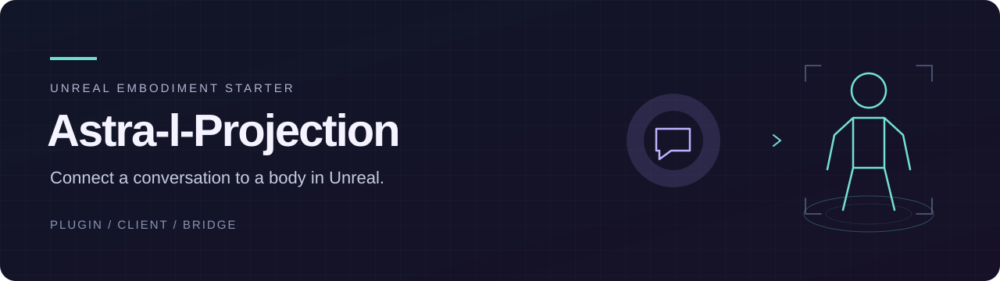
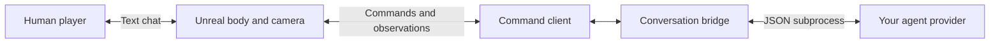

# Astra-l-Projection

[](https://github.com/CinvanaAI/Astra-l-Projection/actions/workflows/checks.yml)
[](LICENSE)

**Connect a conversation to a body in your Unreal world.**

A source developer starter built with Astra: an Unreal plugin, a Python command client, and a conversation bridge. Give an agent a first-person camera, bounded movement, and text communication while you retain your own player and viewpoint. Bring your own world and character, then build on the code.

**[Get started](docs/QUICKSTART.md)** · **[Review the project](docs/REVIEWER-GUIDE.md)** · **[Validation record](docs/VALIDATION.md)** · **[Build on it](docs/EXTENDING.md)**

**[Download the developer preview](https://github.com/CinvanaAI/Astra-l-Projection/releases/tag/v0.1.0-preview.1)** — source, instructions and checks; bring your own Unreal project.

## What you can build from

Importing a character supplies an asset. This code supplies the connection through which a conversational agent can observe and operate a body in the world.

| Component | Responsibility |
| --- | --- |
| [AgentEmbodiment plugin](Plugins/AgentEmbodiment/) | Native movement and collision, eye-camera capture, local human controls, text events, and action results. |
| [Command client](client/) | Submit bounded commands, wait for matching results, and validate capture metadata. Python standard library. |
| [Conversation bridge](bridge/) | Send human messages and observations to a configured provider, execute its actions, then return measured results for its reply. |
| [Diagnostic provider](examples/mock_agent.py) | Try the connection without an account or model call. Deterministic test code. |
| [Optional Codex provider](adapters/) | Connect your own authenticated Codex CLI, with optional image input. |
| [Installation tools](tools/) | Copy plugin source into your project and check the release file inventory. |

The provider interface is JSON over a local subprocess. The Unreal connection is a local file queue with session and request identities. You can replace the provider without rewriting the native body controls.



The bridge validates provider decisions and submits their actions through the client. It allows at most four actions per human turn, followed by a results response. Movement executes locally; a local stop remains available while the provider is thinking. Stale commands and uncertain delivery receive explicit handling.

## Start small

You need an **Unreal C++ project**, compatible native build tools, and **Python 3.10+**. Compile the source plugin in your project, place its agent actor above a blocking floor, and start one local Play session. An engine primitive provides the initial proxy; Blender and an imported avatar are optional.

After following the [installation and map setup](docs/QUICKSTART.md), run these from the repository root:

```powershell
$queuePath = "D:\UnrealProjects\MyProject\Saved\AgentEmbodiment"
python client/player.py --root $queuePath observe
python client/player.py --root $queuePath look --yaw-delta-deg 15
python client/player.py --root $queuePath move --forward 1 --seconds 0.25 --speed-cm-s 80
python client/player.py --root $queuePath say --text "Hello from the embodiment interface."
python client/player.py --root $queuePath stop
```

Open the returned camera image and check the actual movement result. Then try the [diagnostic conversation bridge](bridge/README.md), connect your own provider, or attach your own character.

## What has been verified

| Release check | Recorded result |
| --- | --- |
| Separate native build | Compiled and linked with Unreal Engine **5.8.2**, Win64 Development Editor, Visual Studio 2022. |
| Real Unreal runtime | **11 checks** covering measured movement, view changes, collision, stopping, and rejection of stale, expired, or duplicate commands. |
| Conversation round trip | Native human event → Python bridge → diagnostic subprocess → correlated native text reply. |
| Rendered camera | Two fresh **640 × 360** eye-camera PNGs, including a capture after a 90° turn, opened and inspected. |
| Portable Python suites | **31 tests** across the client/bridge, optional Codex adapter, and installer, using Python 3.13.5 on Windows. |

These are release-specific checks in a separate host with generic diagnostic geometry. The conversation check used a native event injection and a deterministic provider. **Live Codex inference and keyboard chat have not been validated.** Other character/animation setups, engine versions, operating systems, packaged-game cooking, and multiplayer remain unverified. See the [complete evidence and reproduction instructions](docs/VALIDATION.md).

## Scope

This is an **experimental developer starter**, distributed as source. Your project supplies its map, collision, assets, and animation. The package includes no avatar, room, private conversation, credentials, or engine assets. The optional Codex adapter uses your own account and allowance; its visual mode requires explicitly enabling image input.

The initial action vocabulary is `observe`, `look`, `move`, `stop`, and `say`. Physical hands, universal rig setup, continuous autonomous perception, speech audio, and world persistence are outside this release. The [extension guide](docs/EXTENDING.md) identifies where to add capabilities.

## Built with Astra

Astra helped implement and iterate on the original runtime controls, observation/action interface, and conversation routing under human direction and evaluation. This release extracts that foundation and adds portable connection tools with their own checks. The [provenance notes](docs/PROVENANCE.md) distinguish the original prototype from release adaptations.

## Review and contribute

Start with the [reviewer guide](docs/REVIEWER-GUIDE.md) for a focused inspection or fresh installation. See [CONTRIBUTING.md](CONTRIBUTING.md) for changes and validation.

[MIT licensed](LICENSE). Unreal and optional model-host dependencies are installed separately and carry their own terms; see [third-party notices](THIRD-PARTY-NOTICES.md).
